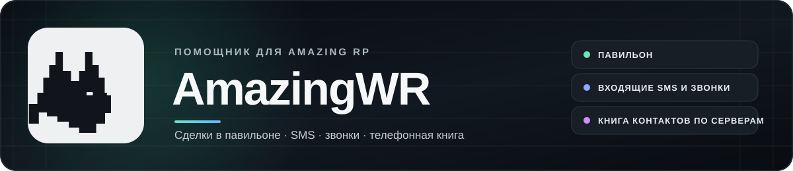
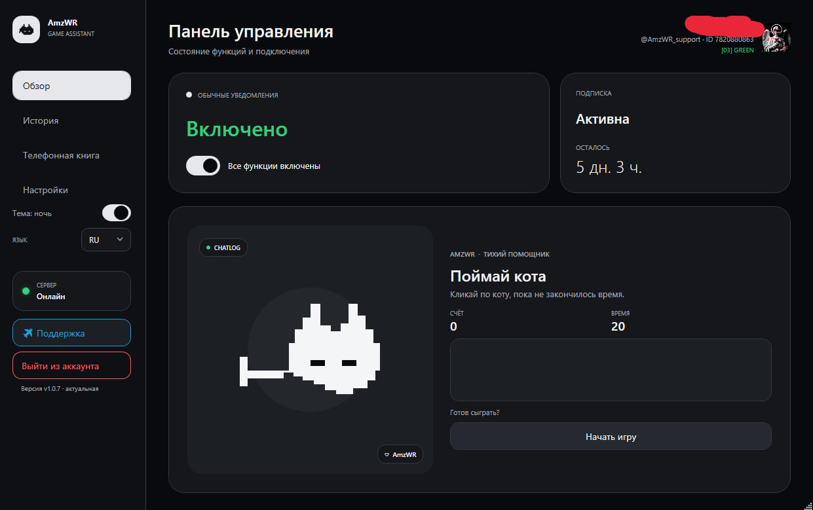
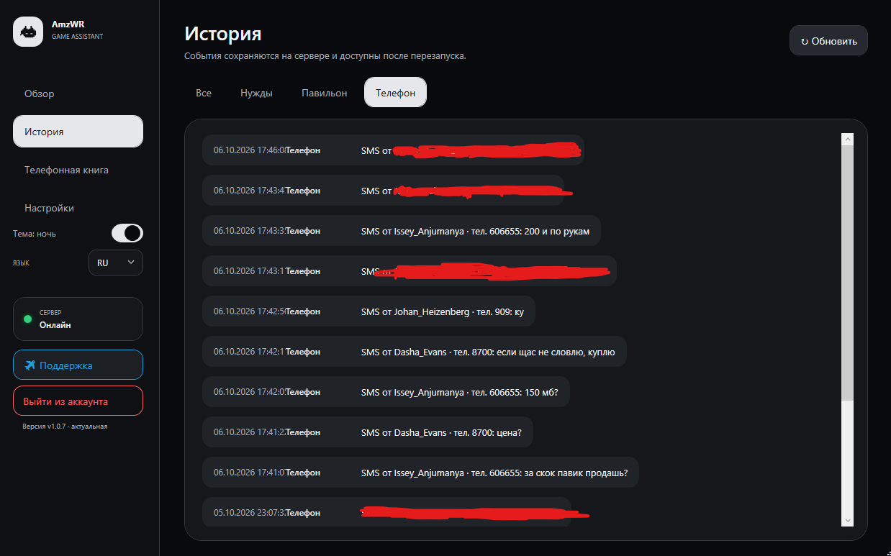
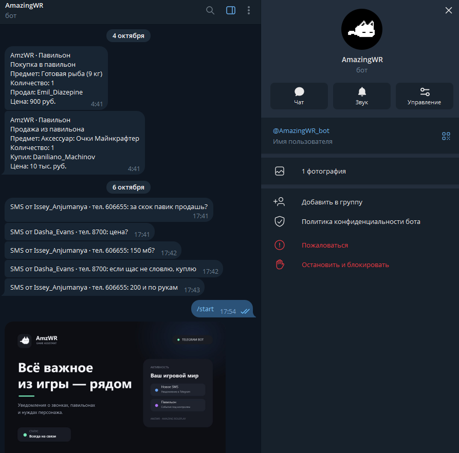

<p align="center">
  
</p>

<div align="center">

# AmazingWR

### Уведомления о торговле и входящих контактах в Amazing RP

Компактный помощник для игроков, которые занимаются перепродажей и следят за сделками в павильоне.

[Скачать последнюю версию](https://github.com/DIRECT17/AmazingWR/releases/latest)

</div>

## Как это выглядит

<table>
  <tr>
    <th align="center">Главный экран</th>
    <th align="center">История уведомлений</th>
  </tr>
  <tr>
    <td></td>
    <td></td>
  </tr>
</table>

### Уведомления в Telegram

Бот присылает краткие сведения о сделках в павильоне и входящих сообщениях.

<p align="center"></p>

## Что умеет AmazingWR

- **Сообщает о сделках в павильоне:** уведомляет о покупке и продаже, показывает предмет, количество, цену и имя игрока.
- **Следит за телефоном:** выводит уведомления о входящих SMS и звонках с именем и номером собеседника.
- **Собирает телефонную книгу:** сохраняет имена и номера из входящих SMS и объявлений в игровом чате.
- **Разделяет контакты по серверам:** номер хранится в телефонной книге своего сервера, поэтому контакты с разных серверов не смешиваются.

Уведомления появляются в приложении, а история событий и телефонная книга доступны в клиенте.

## Как начать

1. Откройте Telegram-бота [@AmazingWR_bot](https://t.me/AmazingWR_bot) и запустите его.
2. Скопируйте свой **Telegram ID**, который покажет бот.
3. Запустите клиент AmazingWR и вставьте этот ID в окно входа.
4. Укажите путь к `chatlog.txt` игры и включите нужные уведомления.

Используйте один и тот же Telegram ID в боте и клиенте — так приложение подключится к вашему аккаунту и сможет показывать ваши события.

## Телефонная книга

Книга общая для игроков и ведётся отдельно для каждого сервера Amazing RP. В неё попадают номера из входящих SMS и объявлений в чате. Имя игрока, номер и время последнего изменения отображаются в списке; контакты можно искать по имени или номеру.

## Скачать

Актуальный установочный файл **AmazingWR.exe** находится на странице [последнего релиза](https://github.com/DIRECT17/AmazingWR/releases/latest). В разделе [всех релизов](https://github.com/DIRECT17/AmazingWR/releases) можно посмотреть предыдущие версии.

## Сборка из исходников

Клиент предназначен для Windows x64. Для самостоятельной сборки установите [.NET 10 SDK](https://dotnet.microsoft.com/download/dotnet/10.0), откройте PowerShell в папке проекта и запустите:

```powershell
./scripts/build-app.ps1
```

Готовый файл появится в папке `dist/`.
